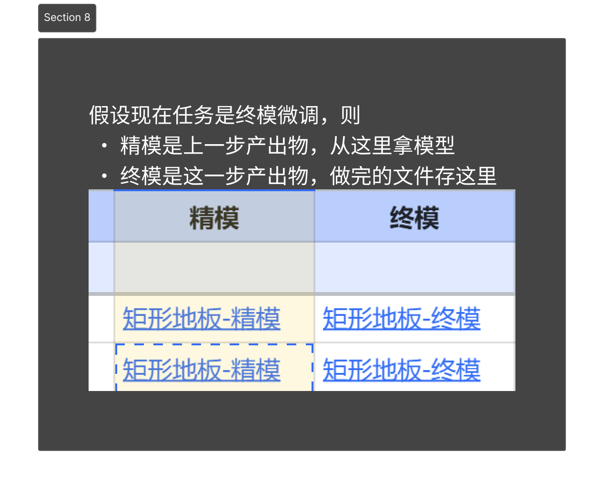
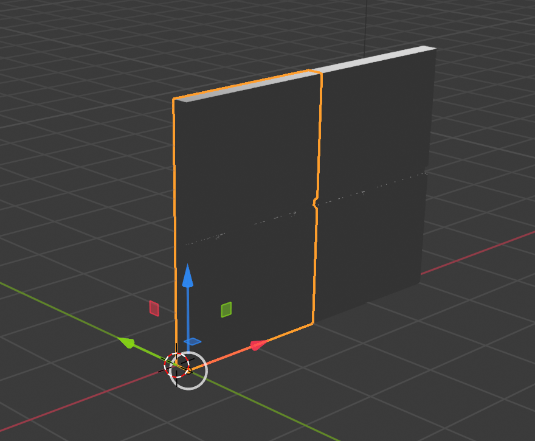
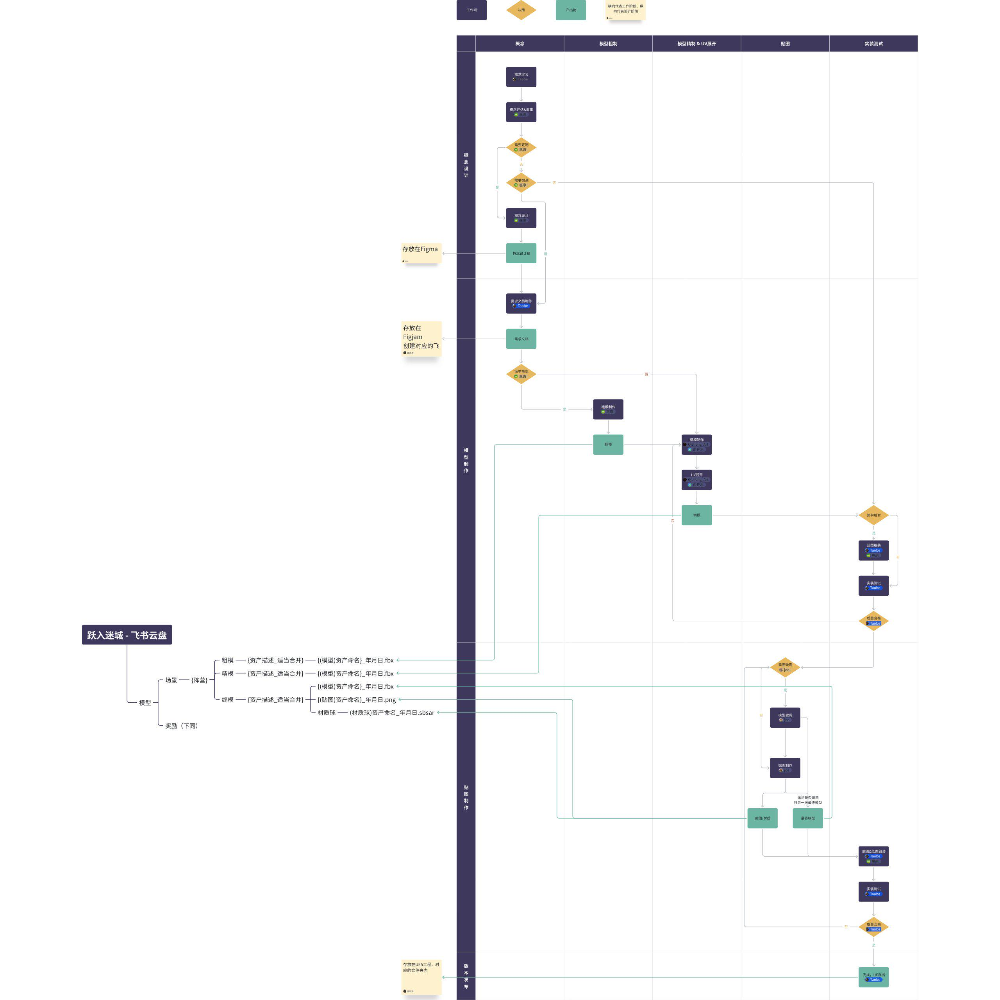

**模型流程**

**步骤**

1. 检查模型表格[关卡设计](https://dikpa4hrtn9.feishu.cn/wiki/SBUQw11QGiUvvNkDo8OcqZNfnOe?from=from_copylink)的**“模型资产”**SHEET，确认现在自己的待办任务和进度
2. 通过[关卡设计](https://dikpa4hrtn9.feishu.cn/wiki/SBUQw11QGiUvvNkDo8OcqZNfnOe?from=from_copylink)表格，获取到上一个步骤产出物的文件夹链接，下载上一个步骤的产出物
3. 制作模型和贴图
4. 通过[关卡设计](https://dikpa4hrtn9.feishu.cn/wiki/SBUQw11QGiUvvNkDo8OcqZNfnOe?from=from_copylink)表格，访问到对应步骤的文件夹，上传产出物



5. 完成

**流程备注**

1. @Taobe额外基于[关卡设计](https://dikpa4hrtn9.feishu.cn/wiki/SBUQw11QGiUvvNkDo8OcqZNfnOe?from=from_copylink)制作了[任务清单](https://applink.feishu.cn/client/todo/task_list?guid=6bfdfbbc-ab55-4bb9-8f91-4c5954f19c46)，只是便于查阅，一切以表格为准
2. 终模和精模可以完全一致，取决于制作贴图期间/后是否有模型微调的需求
3. 没有制作新mesh的模型需求，可以不在云盘存档，但依旧会被记录到表格

**文件**

1. 针对模型，我们统一以**.fbx**为交付格式
2. 文件在各自制作流程中，尊重原有模型制作软件的尺寸和坐标系即可
1. 例如Blender用m作为单位，则创建1m的墙壁时，按照1m创建即可
2. Blender用-Y作为前方向，则创建面朝前的墙壁时，在Blender内面朝-Y即可
3. 所有转换会在导入UE时完成
3. 文件的命名采用[关卡设计](https://dikpa4hrtn9.feishu.cn/wiki/SBUQw11QGiUvvNkDo8OcqZNfnOe?from=from_copylink)中模型资产sheet的资产命名字段，并附上"\_YEARMONTHDATE"上传时间后缀
4. 当多个MESH可以明确的归纳到一个子类时，提交的fbx文件可以归纳到一个，命名则是去掉被归纳的部分，主要适用于不同尺寸的相同零件的情况，例如：
- 4个不同尺寸的墙壁，命名为：SM\_Labor\_Wall.fbx，去掉了尺寸部分

```<p>- 上述的多个对象，每个mesh本身需要保证在fbx内的坐标精准</p><p></p>|<p></p><p>图上4个mesh都把坐标对齐到了远点，而非分开排布</p>
``` :-: |
5. 导出的fbx需要符合UE5的坐标系规则，也即**X是前**，**Z是上**。尺寸缩放不用在建模软件中处理

**流程图**



