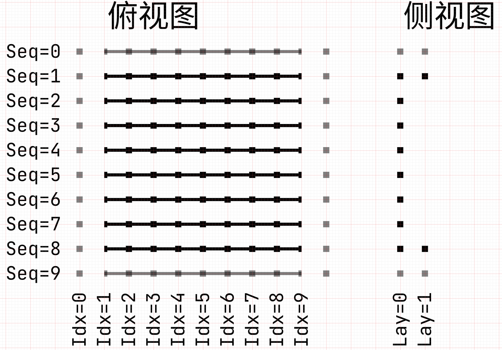
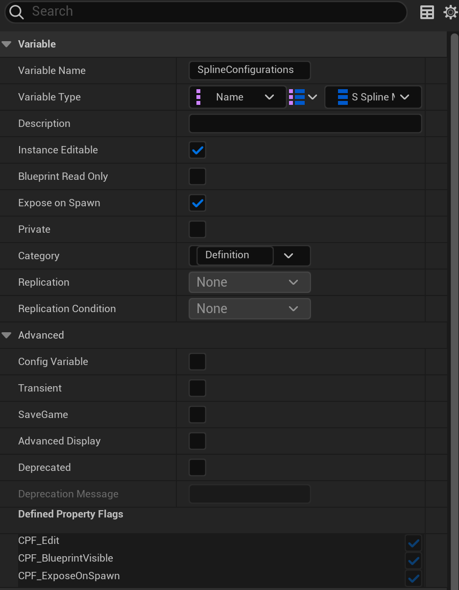
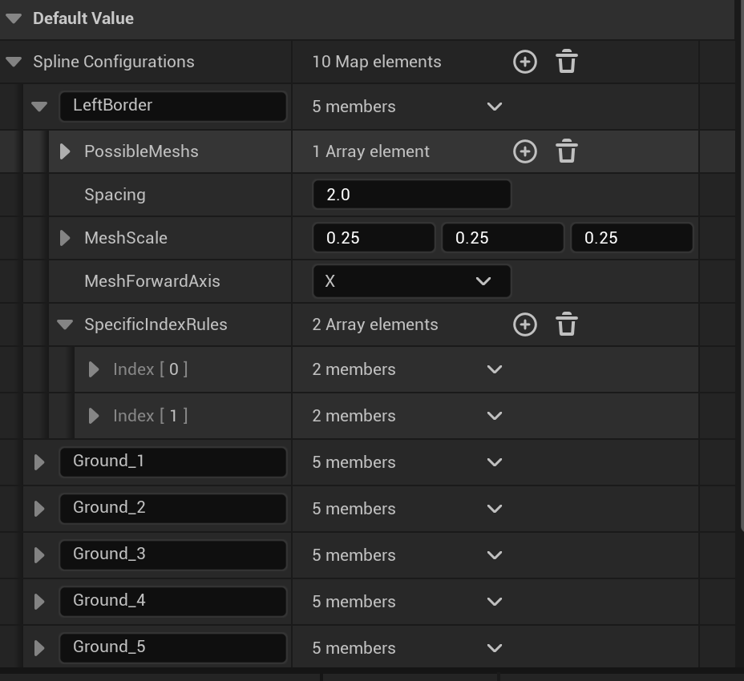

**Evaluation Only. Created with Aspose.Words. Copyright 2003-2021 Aspose Pty Ltd.**

**轨道设计**

\1. **概念**

1.1 **单位和尺寸**

**建模对象：**游戏开发中有2个最重要的建模对象，也可以作为尺寸单位：

- **轨道 (Rail）：**一个迷宫由多个轨道构成，轨道可长可短，但存在尺寸上限、下限
- 轨道至少要占据16 x 16 x 16cm的空间（在UE里），对应到voxel单位是640 x 640 x 640 voxel，这个尺寸也可以简化为 1 rail
- **体素块 (Block）：**一个基本直轨由8x8个体素块构成地面。体素块有2个可以互相换算的
- **模型尺寸：**体素块直接导入Blender或UE的真实尺寸
- 标准尺寸是8m/8cm（blender到ue有100倍比例差）
- **设计尺寸：**体素块根据轨道设计图的尺寸，也是Spline Mesh在UE里的真实尺寸
- Spline Mesh生成时，会把真实尺寸的体素块缩小0.25倍
- 此时标准尺寸变成2m/2cm，这样8个体素块构成1个16cm的标准轨道
- 该设计是为了保证体素块本身设计、调整的便利和最终迷宫尺寸的控制

**尺寸单位:** 我们还涉及一些纯粹的尺寸单位，单独在此列出：

- **设计尺寸 (mm/cm)：**设计迷宫时的单位，Fusion 360内的设计尺寸为mm，UE为cm
- 两者可以直接在数值上1:1换算，因为模型在导入时会自动换算
- 一个标准、最短直轨在UE5里生成后，尺寸是16 x 16cm（用cm便于识别是ue的尺寸）
- **体素 (Voxel)：**MagicaVoxel里的一个体素点
- 一个标准的体素块由 80x80x80 (160，如果是侧边建筑)个体素点构成
- 也就是说，80 voxel = 2cm
- **换算：**
- 1 rail = 8 block
- 1 rail = 16 cm
- 1 block = 80 voxel
- **所以：**
- 1 rail  = 8 block = 16 cm = 640 voxel
- 1 block = 2 cm
- 1 cm = 40 voxel

1.2 **标准基础元素 (Standard Base Elements)**

这些是在编辑器中可能提供的、用于构建场景的**标准**尺寸的块（非轨道）。

**标准地面 (Standard Ground)**:

- Block 尺寸 (设计尺度): 80 × 80 × 80 体素单位
- 对应引擎尺寸 (厘米): 2cm × 2cm × 2cm

**标准建筑 (Standard Building)**:

- Block 尺寸 (设计尺度): 80 × 80 × 160 体素单位
- 对应引擎尺寸 (厘米): 2cm × 2cm × 4cm

**标准小球 (Standard Ball):**

- Block 尺寸 (设计尺度): 直径 400 体素单位
- 对应引擎尺寸 (厘米): 10cm

1.3 **坐标系统 (与 UE5 默认对齐)**

采用 Z 轴向上 (Z-Up) 的右手坐标系。

**轴向定义:**

- +X: 前进 (Forward)
- +Y: 右 (Right)
- -Y: 左 (Left)
- +Z: 上 (Up)
- -Z: 下 (Down)

1.4 **轨道单元（Rail Block）定义**

**局部坐标系:** 每个轨道单元在自身局部坐标系中定义。

**标准起点:** 非 **Start** 单元的轨道路径入口点（连接点）位于其局部坐标系原点 (0, 0, 0)。

**初始延伸方向:** 沿局部坐标系 +X 轴。

**空间占用与对齐:** 单个轨道单元包围盒通常跨越至少一个（或多个）迷宫单元。放置和对齐依据迷宫单元边界。

**特殊单元:**

- **Start 单元:** 迷宫起点，无标准入口点，有出口点。如果不是最先放置，对齐时用出口对齐其他轨道入口。
- **End 单元:** 迷宫终点，有标准入口点，无标准出口点。

\2. **关键尺寸**

- 起点的洞直径：2cm / 80mv
- 检查点的洞直径：4cm / 160mv
- 终点的洞直径：6cm / 240mv
- 开槽轨道的槽宽：6cm / 240mv
- 带洞轨道的洞直径：12cm / 480mv

\3. **轨道的 PCG Mesh 生成**

**6/6新增功能**

**目标**

1. 避免每一节Rail的最后一个可能出现开放端口的情况
2. 降低Rail配置的手动计算工作，让PCG可能性变得更自由
1. 现在如果我们在第一条Spline配置了**“人行道”**，它隔壁的Spline就要配置**“人行道到马路”**的mesh，但如果我们希望第一条Spline是随机出现**“草地”**和**“人行道”**，当前的逻辑就无法实现
3. 为Rail之间的PCG匹配做准备工作
1. 现在每一节Rail都是独立生成PCG内容的

**准备工作**

1. 为每个Spline增加3个Variante
1. ~~Int{Layer}：用于表示Spline在第几层~~
1. ~~我们目前只有2层：0 = Ground；1 = Side~~
2. ~~由策划手动配置到每个Spline~~
2. ~~Int{Seq}：用于表示这是该层的第几条Spline -> 当前的Spline Loop Array Index~~
1. ~~我们每个层有8个实际可用的Seq，对应8条Spline：0~7~~
2. ~~Layer = Side时，很显然中间6条都会留空，这没关系~~
3. ~~为了进行Rail间匹配，以及Rail内的自动PCG，还需要预留2条（最前和最后）Seq，因此实际上我们会有0~9一共10个Seq No.其中真的对应到每个BP\_Rail内的Spline的会是1~8号~~
3. ~~IntArray{Index}：用于表示每个Spline上生成Mesh的Index -> 当前的Segment Index~~
1. ~~这个事实上应该已经有了，但需要做一些微调~~
2. ~~我们每条Spline有8个实际可用的Index，对应8条Spline：0~7~~
3. ~~为了进行Rail间匹配、Rail内的自动PCG、以及解决Rail在末尾位置开口的问题，还需要预留2条（最前和最后）Index，因此实际上我们会有0~9一共10个Index No.其中真的对应到每个Spline内的Mesh Index的会是1~8号~~
4. IntMap{IndexStatus}：用于表示Index的情况
- 0 = 未生成Mesh的普通Index
- 1 = 已生成Mesh的普通Index
- 2 = 未生成Mesh的占位符Index
2. SplineConfigurations的Element新增以下配置参数：
1. LeftOpeningType
2. RightOpeningType
3. LeftStyleType
4. RightStyleType
5. 以上参数也需要添加到SpecificIndexRule
3. 完成上述准备工作的BP\_Rail形如下图：
1. 此时，通过{Layer}{Seq}{Index}可以具体定位到某一BP中的任意一个MESH和它的属性

**策划配置**

1. ~~上述的Layer和Seq需要重新配置~~
2. ~~每个BP\_Rail的Seq = 0和Seq = 9的Spline，以及对于Index = 0/9的格子无需人工配置，默认赋值以下参数。在PCG逻辑中，该赋值会用于处理头、尾的封闭面逻辑~~
1. ~~IndexStatus = 2~~
2. ~~OpeningType（4个方向）= Close~~
3. ~~每条Spline需要配置Index = 0 和 Index = 9的Block的以下属性~~
4. Mesh配置不变，也就是继续沿用现有的SplineConfigurations逻辑，只是每个Member新增了参数

**开始PCG**

1. 先对所有SpecificIndexRules的Index进行生成
1. 这里关注的是实际出random的结果，而非进行random顺序；SpecificRules应该先于PossibleRules把格子填上
2. 这主要是为了一些特殊位置的Mesh（比如洞口）
3. 生成期间，匹配逻辑沿用现有（更新后的）逻辑（洞口也要符合Style和Open）
4. 头、尾的Mesh和两侧Mesh不再需要用该功能生成封闭面，将会由OpeningType自然匹配
1. 所以我就可以一股脑把所有VOXEL丢进PossibleMeshs里了
2. 在现有匹配逻辑上增加判定对象：不仅判断Index - 1的Mesh，也判断Index + 1的Mesh和Seq - 1的Mesh
1. Index - 1：对应同一Spline的上一个Mesh，判断Open和Style是否匹配
2. Index + 1：对应同一Spline的下一个Mesh，主要用于处理倒数第二个Mesh可能和最后一个Mesh不匹配的问题，当下一个Mesh未生成时，自然忽视该条件
3. Seq -/+ 1：对应上一条平行Spline的同一Index位置的Mesh，判断Open和Style是否匹配，逻辑和普通判断相同
3. ~~然后从Layer 0~1，Seq 1~8，Index 1~8进行生成，跳过占位符的2条Spline和每条2个Index~~
1. ~~该实现可以写死逻辑（Loop Index），也可以用IndexStatus做判断，不影响效果（我猜）~~

**跨Rail的PCG**

1. 该功能建议独立开发，和上述功能分开时间做，确保至少一部分功能基准正确，降低返工风险
2. 首先需要判断2个BP\_Rail是否前后/左右紧贴，这个需要@Decay你想想办法，前后可能还好解决一点，左右可能会涉及到弯轨和直轨不属于紧贴的情况，如果能直接判断Spline头尾是否符合distance规则就最好解决了。
1. 根据我设计的规则，该判断不需要在所有生成任务前完成，只需要在每个BP\_Rail自己的生成任务前完成就可以，因此应该不需要纳入RailManager，只需要在Rail里完成程序逻辑。
3. 假设有一前、一后2个RailA和RailB，判断紧贴为true以后：
1. RailA应该将每个Seq的Index9（末尾占位符），替换成空值，然后重新生成Index8
2. RailB应该将每个Seq的Index0（起点占位符），替换成RailA的同Seq、重新生成的Index8
1. 该逻辑最主要的影响：IndexStatus从2变成0或1（取决于RailB是否已经生成，但应该是0）且匹配对象的BegainOpenType变为空、任意匹配（而非占位符的Close），从而让Rail的末尾/开头可能生成开放Mesh并与下一节Rail的Mesh进行连接
3. 如果RailA已经存在Index8的Mesh（Status = 1）应该销毁Index8并重新生成Index8
4. 然后RailB开始完整的生成轨道、或重新生成自己的Index1
4. 针对左右2个Rail紧邻的情况，判断紧贴为true以后，逻辑同上，区别是：
1. 替换的应该是对应Layer的占位符Spline0/9，一次性需要替换1~8的Index
5. 针对更复杂的多段Rail连接情况，核心逻辑是按顺序多个生成即可

**原有功能**

轨道上的 MESH 使用 PCG 生成，每个 MESH 沿 SPLINE 从起点向终点生成。

BP\_RAIL 配置 SplineConfigurations (StructureMap)，包含每条 Spline 的匹配规则。

1. 轨道上的 MESH 使用 PCG 生成，每个 MESH 沿 SPLINE 从起点向终点生成。
2. BP\_RAIL 配置 SplineConfigurations (StructureMap)，包含每条 Spline 的匹配规则。

|||
| :-: | :-: |
3. Spline 可配置 Component Tags，若与 SplineConfigurations 的 MAP Index 匹配，则调用对应 Configurations 生成 MESH。
4. SpecificIndexRules 定义特定索引位置允许生成的 Mesh，主要用于定义 Rail 起点和终点 Mesh，可被跨轨道连续性规则复写。
5. PossibleMeshs 为 StaticMesh Array。
6. Spline 间融合问题由策划/美术层面解决。
7. PossibleMeshs 中每个 Index 包含：StartOpeningType (起点开口类型), EndOpeningType (终点开口类型), StartStyleType (起点视觉组), EndStyleType (终点视觉组)。
8. PCG 执行时，每条 Spline 逐个生成 Mesh，根据上一个 Mesh 的 EndOpeningType 和 EndStyleType，筛选当前 Index 的 PossibleMeshs 中 StartOpeningType 和 StartStyleType 匹配的 Mesh 池，并从中随机生成。
1. 2个匹配对象中的其中任意一个为空，意味着可以随意匹配

\4. **难度测算**

- 每个BP\_Rail有一个Int{Drail}，策划会手动为每个Rail赋值Drail
- 应当有一个功能/工具，可以查看每个BP\_Maze下的Drail和
- 迷宫难度计算规则见：[迷宫设计](https://dikpa4hrtn9.feishu.cn/wiki/Q2oOwRBajiBMWKk9t0YcPtoKnzb#share-BumHdxfkioSRwHxklLTcy55hnPg)
- 目前针对悬空情况的自动化计算，我打算用带出口的EMPTY BLOCK处理

\5. **RAIL CONFIG**

- BP\_RAIL
- DETAILS
- Default
- Spline Mesh Configurations Origin -> 删了，不需要
- PCG Config -> 上移，和Default一个层级
- 1 VoxelOnSplineDefinition -> 要有空格就大家都有，
- Mesh Scale -> 这个似乎不生效
- Rail Material Override -> 这个其实可以移除了，但先不管好了
- 2 Config Override
- Generated -> 不需要
- Override 1 -> 哪些值？？？以及讲实话我觉得不需要
- Override 2 -> 同上
- Spline Collision Proxys -> 这个是干嘛用的？
- Spline Mesh Configurations -> 核心问题，复写在这里
- Spline Tag Name -> 这个应该动态生成而不是pre set，也即在BP里应该为空
- PossibleMeshes
- Spacing
- MeshScale

**Created with an evaluation copy of Aspose.Words. To discover the full versions of our APIs please visit: https://products.aspose.com/words/**

